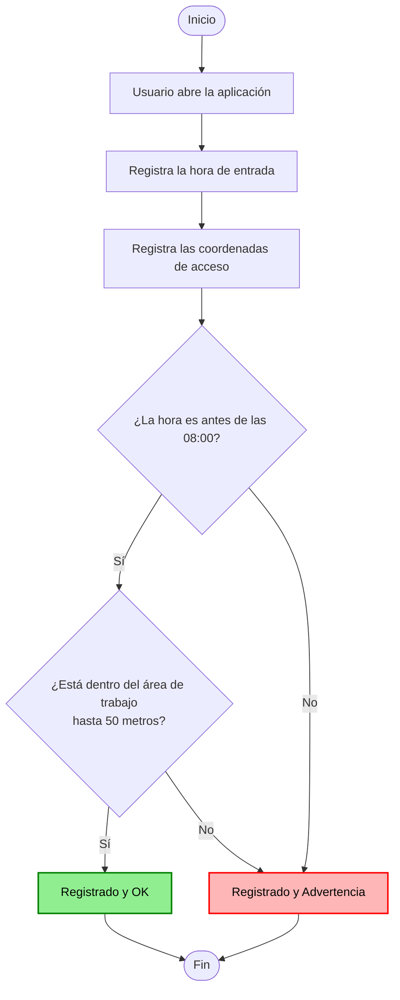

# Diagrama de registro de entrada
Este proyecto representa el proceso de registro de entrada de un usuario.

```mermaid
flowchart TD
    A([Inicio]) --> B[Usuario abre la aplicación]
    B --> C[Registra la hora de entrada]
    C --> D[Registra las coordenadas de acceso]
    D --> E{¿La hora es antes de las 08:00?}

    E -->|Sí| F{¿Está dentro del área de trabajo<br>hasta 50 metros?}
    E -->|No| H[Registrado y Advertencia]

    F -->|Sí| G[Registrado y OK]
    F -->|No| H

    G --> I([Fin])
    H --> I

    classDef ok fill:#90EE90,stroke:#008000,stroke-width:2px,color:#000
    classDef advertencia fill:#FFB6B6,stroke:#FF0000,stroke-width:2px,color:#000

    class G ok
    class H advertencia
```
